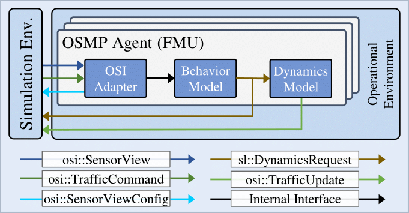
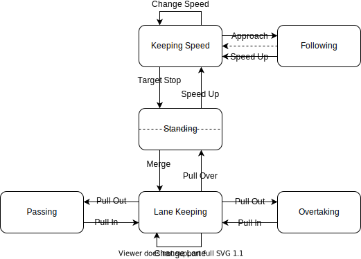

# Integration of an Agent Model into an Open Simulation Architecture for Scenario-Based Testing of Automated Vehicles

This repository contains the modular integration of our closed-loop agent model within an open simulation architecture presented in our [paper](TODO). We provide a straight-forward simulation integration approach based on standards such as FMI and the Open Simulation Interface (OSI) enabling the [agent model](https://github.com/ika-rwth-aachen/SimDriver) to be integrated within different simulation tools. The model itself is a responsive, closed loop and human-like agent that reacts on other traffic participants and is able to perform basic maneuvers. Find a brief description of the simulation architecture but also the agent model itself in the sections below.

<p align="center">
  
</p>

> *Fig. 1: Intersection scenario populated by multiple agents within the exemplary simulation tool CARLA. The agent model's main capabilities are highlighted to demonstrate a responsive and human-like behavior. In addition, the general integration process is illustrated, starting with the development of the agent model, subsequent simulation integration, and final testing.*

## Notice

> [!IMPORTANT]  
> This repository is open-sourced and maintained by the [**Institute for Automotive Engineering (ika) at RWTH Aachen University**](https://www.ika.rwth-aachen.de/).  
> **Simulation, Agent Models and Human-in-the-Loop for Automated Driving** are some of many research topics within our [*Vehicle Intelligence & Automated Driving*](https://www.ika.rwth-aachen.de/en/competences/fields-of-research/vehicle-intelligence-automated-driving.html) domain.  
> If you would like to learn more about how we can support your DevOps or automated driving efforts, feel free to reach out to us!  
> &nbsp;&nbsp;&nbsp;&nbsp; *Timo Woopen - Manager Research Area Vehicle Intelligence & Automated Driving*  
> &nbsp;&nbsp;&nbsp;&nbsp; *+49 241 80 23549*  
> &nbsp;&nbsp;&nbsp;&nbsp; *timo.woopen@ika.rwth-aachen.de*

## Content
- [Integration of an Agent Model into an Open Simulation Architecture for Scenario-Based Testing of Automated Vehicles](#integration-of-an-agent-model-into-an-open-simulation-architecture-for-scenario-based-testing-of-automated-vehicles)
  - [Notice](#notice)
  - [Content](#content)
  - [Publication](#publication)
  - [Getting Started](#getting-started)
    - [Download Artifact](#download-artifact)
    - [Build from Source](#build-from-source)
  - [Concept](#concept)
    - [Open Simulation Architecture](#open-simulation-architecture)
    - [Agent Model](#agent-model)
    - [External Interface](#external-interface)
  - [References](#references)
  - [Citation](#citation)
  - [Acknowledgements](#acknowledgements)


## Publication

> **Integration of an Agent Model into an Open Simulation Architecture for Scenario-Based Testing of Automated Vehicles**  
> > *([arXiv](TODO), [ResearchGate](TODO))*  
>
> [Christian Geller](https://www.ika.rwth-aachen.de/de/institut/team/fahrzeugintelligenz-automatisiertes-fahren/geller.html), [Daniel Becker](https://www.linkedin.com/in/danielbac/), [Jobst Beckmann](https://www.ika.rwth-aachen.de/en/institute/team/vehicle-intelligence-automated-driving/beckmann.html), [Lutz Eckstein](https://www.ika.rwth-aachen.de/en/institute/team/univ-prof-dr-ing-lutz-eckstein.html)
> [Institute for Automotive Engineering (ika), RWTH Aachen University](https://www.ika.rwth-aachen.de/en/)
> 
> <sup>*Abstract* – Simulative and scenario-based testing are crucial methodologies in the safety assurance for automated driving systems. This work presents a responsive and modular agent model that depicts human driver behavior in simulation. The behavior is achieved by modeling various capabilities such as naturalistic free driving, reasonable following, or obeying basic traffic rules. It can be easily integrated into multiple common closed-loop simulation tools. Therefore, it can play an essential role in the safety assessment of automated driving systems in mixed traffic. We propose a generic integration architecture for agent models based on the Open Simulation Interface as a structured message format. In addition, the Functional Mock-up Interface is used for the dynamic exchange of models. The generic nature of the architecture is demonstrated by integrating the agent model into three different simulation environments: OpenPASS, CARLA, and CarMaker. An automatic end-to-end testing framework based on the OpenDRIVE and OpenSCENARIO standards validates all agent model capabilities. In addition, integration tests are conducted with up to 20 agents in a complex interaction. We make the agent model and examplaric simulation integrations publicly available at [https://github.com/ika-rwth-aachen/agent-model-integration](https://github.com/ika-rwth-aachen/agent-model-integration).</sup>

---


## Getting Started

### Download Artifact
We provide a [Github action](./github/workflows/build.yml) that directly builds and packages the model in a FMU. You can download the released FMU [here](TODO).

### Build from Source
The following steps describe how you can build the resulting `ikaAgentModel.fmu` from source.

#### Requirements

**We recommend to use Ubuntu 20.04 or higher and require a working CMake installation.**

Before starting the build process, the repository submodules need to be downloaded:
```
git submodule update --init --recursive
```
> [!NOTE]
> Due to the usage of the CMake feature 'ExternalProject_Add()', there is no need to download and build **protobuf** from source source anymore. 
  
#### Build Model using CMake
1. Create a `build` directory and enter it:
    ```
    mkdir build && cd build
    ```  

2. Execute CMake:
    ```
    cmake -DCMAKE_BUILD_TYPE=Release ..
    ```  

    Please note: The default build directory for the `FMU` is the subfolder `lib/`. If a specific `FMU` output dir shall be used, set the variable `FMU_OUTDIR`, e.g.
    ```
    cmake -DCMAKE_BUILD_TYPE=Release -DFMU_OUTDIR=<dir> ..
    ```  

3. Compile the library:
    ```
    make
    ```

> [!NOTE]
> Optional: `make -j4` for building on multiple cores

#### Debugging
The external FMU parameter `debug` enables debugging log information in the `${workspace}/debug` folder as `json` file and holds information about `horizon`, `vehicle_state` and `driver_state` at each timestep.

In addition the plot python scripts in [scripts](scripts) can be used to visualize the debug information with `matplotlib`.


## Concept

### Open Simulation Architecture

Before describing the agent model itself, its framework is briefly described. 
The implementation uses the [OSI Sensor Model Packaging (OSMP)](https://github.com/OpenSimulationInterface/osi-sensor-model-packaging) framework to pack the library as a standardized [FMU](https://fmi-standard.org/). This way, the model may be integrated in any simulation platform that supports the [Open Simulation Interface (OSI)](https://github.com/OpenSimulationInterface/open-simulation-interface) and FMI.
The figure below illustrates the wrapping around the actual behavior and dynamics model to end up with an encapsulated FMU. The input of the FMU consists of an `osi3::SensorView` for the environment representation and an `osi3::TrafficCommand` which holds information on the agent's task in the simulation run. On the output side the simulator can either use the provided `osi3::TrafficUpdate` to manage the updated pose of the agent or forward the generated `sl::DynamicsRequest` message to another module that then calculates an `osi3::TrafficUpdate`. Inside the FMU, internal interfaces are used to feed the behavior model and then calculate its new position with a simple vehicle model and controllers for pedal values and the steering angle.

<p align="center">
 
</p>

> *Fig. 2: Agent model packed as FMU integrated into an OSI-based simulation architecture.*  

### Agent Model
The model core itself is open-sourced in a dedicated [GitHub repository](https://github.com/ika-rwth-aachen/SimDriver). However, its basic structure and features are described in this section.

#### Information Flow
On the left side of the following figure the input interface is shown. It consists of information on the environment (static + dynamic), the route and the ego vehicle. Inside the model these signals are processed as *Perception* layer. This is currently just a "pass-through" layer, but it would be possible to model the driver's perception ability by disturbing input signals.  
The *Processing* layer takes the environment and traffic data and enriches them with measured values such as TTC or THW. Following, the most suitable maneuver is selected and modeled by conscious guiding variables (e.g. a THW to a leading vehicle that should be maintained). Conscious variables are controlled by the sub-conscious variables acceleration and curvature (*Note:* `Z-micro` corresponds to the later implemented `sl::DynamicsRequest` message here).  
The *Action* layer models the actual dynamics of the vehicle and is visualized as *Dynamics Model* also in the right most block of the previous figure.

<p align="center">
 
</p>
> *Fig. 3: Behavior model architecture (taken from [2]). An extensive discussion of the figure below can be found in [1]*

#### Basic Maneuvers
The agent model is implemented such that basic driving maneuvers are modeled which enable the model to perform most driving tasks that are required in urban scenarios (cf. [1]). Those capabilities or basic maneuvers are illustrated as a state diagram in the following:

<p align="center">
 
</p>
> *Fig. 4: Behavior model basic maneuvers (taken from [2]).*  


#### Parametrization
The most important parameters are directly configurable using FMU parameters:

| Parameter   | Description                                                            |
| ------------| ---------------------------------------------------------------------- |
| `v_init`    | The initial velocity of the agent (in *m/s*)                          |
| `v_desired` | The desired velocity the agent reaches on a straight road (in *m/s*)  |

> [!NOTE]
> All other model parameters can be parameterized directly in the source code of the [agent model](src/IkaAgent.cpp). 


### External Interface
When integrating the agent model within the open simulation architecture, a well-defined interface is required. OSI already defines a valid and powerful baseline.

#### Input: Required Fields in OSI3::SensorView
The following fields are required as OSI inputs for the agent model

```
sensor_view
  host_vehicle_id
  global_ground_truth
    moving_object
      base --> all except base_polygon
      id
      assigned_lane_id --> Is deprecated in osi. Will be changed to classification soon
      vehicle_classification --> maybe fill that as well. The deprecated signal above will be changed
    lane
      id
      classification
        type --> type_intersection is important
        is_host_vehicle_lane
        centerline
        centerline_is_driving_direction
        left_adjacent_lane_id
        right_adjacent_lane_id
        lane_pairing
        right_lane_boundary_id
        left_lane_boundary_id
        subtype
    lane_boundary
      id
      boundary_line
      classification --> not that important for now, but maybe in the future 
    traffic_sign
        main_sign
          base
            position
          classification
            assigned_lane
            type
            value
    traffic_light
      base --> all except base_polygon
      id
      classification
        color
        icon
        assigned_lane_id
    road_marking --> not right now but for stop lines in the future

traffic_command
  action --> the following actions can be considered right now
    acquire_global_position_action
    # path and trajectory are implemented the same as acquire position:
    # the last point of the list is taken and a path along the centerlines
    # ist planned. So it is not really a follow path/trajectory action
    follow_path_action 
    follow_trajectory_action
    speed_action --> the desired velocity is updated
```


#### Output: Fields in OSI3::TrafficUpdate and SL::DynamicsRequest filled by the agent model
The following fields are filled from the agent model and can be used by the simulation tool.

```
osi3
  # Values computed by a simple vehicle model and PID controllers for pedal and steering
  traffic_update
    position (x,y)
    velocity (x,y)
    acceleration (x,y)
    orientation (yaw)
    orientation_rate (yaw)

# Can be used when a separate dynamic module is used (not the agent's dynamics module)
sl
  # Can be used when a separate dynamic module is used (not the agent's dynamics module)
  dynamic_request
    curvature_target
    longitudinal_acceleration_target
# Note: these are *desired* values from the behavior model
```


## References
[1] *System Design of an Agent Model for the Closed-Loop Simulation of Relevant Scenarios in the Development of ADS*, 29th Aachen Colloquium 2020, 07.10.2020, Aachen. Jens Klimke, E.Go Moove GmbH; Daniel Becker, Institut für Kraftfahrzeuge (ika); Univ.-Prof. Dr.-Ing. Lutz Eckstein, Insitut für Kraftfahrzeuge (ika)

[2] *Agentenmodell für die Closed-Loop-Simulation von Verkehrszenarien*, ATZelektronik 05 Mai 2021, 16. Jahrgang, S.42-46. Daniel Becker, Jens Klimke, Lutz Eckstein. Link: https://www.springerprofessional.de/agentenmodell-fuer-die-closed-loop-simulation-von-verkehrsszenar/19141908


## Citation
We hope that our agent model integration can help your research. If this is the case, please cite it using the following metadata.
```
@inproceedings{AgentModel24,
author = {Geller, Christian and Becker, Daniel and Beckmann, Jobst and Eckstein, Lutz},
title = {{Integration of an Agent Model into an Open Simulation Architecture for Scenario-Based Testing of Automated Vehicles}},
url = {TODO},
year = {2024}
}
```


## Acknowledgements
The work of this paper has been done in the context of the [SUNRISE](https://ccam-sunrise-project.eu/) project which is co-funded by the European Commission’s Horizon Europe Research and Innovation Programme under grant agreement number 101069573. Views and opinions expressed, are those of the author(s) only and do not necessarily reflect those of the European Union or the European Climate, Infrastructure and Environment Executive Agency (CINEA). Neither the European Union nor the granting authority can be held responsible for them.

Additionally, this work received funding from the [SET Level](https://setlevel.de/) and VVM projects as part of the PEGASUS project family, promoted by the German Federal Ministry for Economic Affairs and Energy based on a decision of the Deutsche Bundestag.