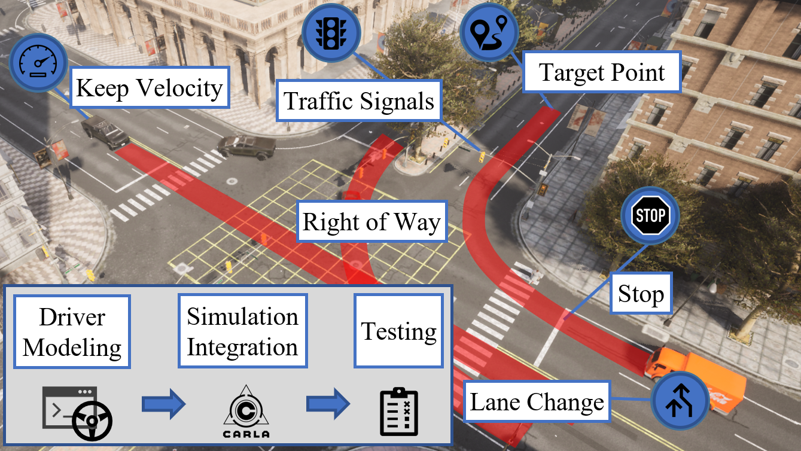
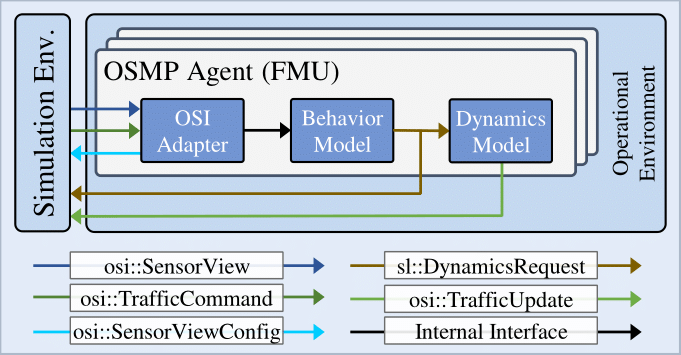
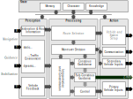
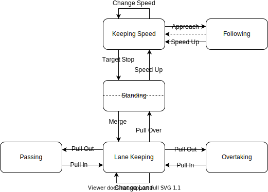

# Agent Model

This agent model is a responsive, closed loop and human-like agent that reacts on other traffic participants and is able to perform basic maneuvers. 
The model is based on the work done by [1] and got extended with an OSI adapter and a modular simulation architecture. The model described in [1] is available on [GitHub](https://github.com/ika-rwth-aachen/SimDriver). The agent model was developed by the institute for automotive engineering, RWTH Aachen University.

  


## Modeling Approach
In the following, the implementation concept is outlined.

### Framework
Before describing the model itself, its framework is briefly described. 
The implementation uses the [OSI Sensor Model Packaging (OSMP)](https://github.com/OpenSimulationInterface/osi-sensor-model-packaging) framework to pack the library as a standardized [FMU](https://fmi-standard.org/). This way, the model may be integrated in any simulation platform that supports the [Open Simulation Interface (OSI)](https://github.com/OpenSimulationInterface/open-simulation-interface) and FMI.
Fig. 1 illustrates the wrapping around the actual behavior and dynamics model to end up with an encapsulated FMU. The input of the FMU consists of an `osi3::SensorView`  for the environment representation and an `osi3::TrafficCommand` which holds information on the agent's task in the simulation run. On the output side the simulator can either use the provided `osi3::TrafficUpdate` to manage the updated pose of the agent or forward the generated `sl::DynamicsRequest` message to another module that then calculates an `osi3::TrafficUpdate`.  
Inside the FMU, internal interfaces are used to feed the ika behavior model and then calculate its new position with a simple vehicle model and controllers for pedal values and the steering angle.

  
Fig. 1: OSMP wrapping of the agent model  

### Behavior Model
The model core is hosted on [GitHub](https://github.com/ika-rwth-aachen/SimDriver) and its basic structure and features are described in this section.

#### Information Flow
An extensive discussion of Fig. 2 can be found in [1]. However, the basic concept of the agent model shall be outlined. 
On the left side of Fig. 2 the input interface is shown. It consists of information on the environment (static + dynamic), the route and the ego vehicle. Inside the model these signals are processed the *Perception* layer. This is currently just a "pass-through" layer, but it would be possible to model the driver's perception ability by disturbing the signals.  
The *Processing* layer takes the environment and traffic data and enriches them, e.g., with TTC or THW measures. Then, the most suitable maneuver is selected and modeled by conscious guiding variables (e.g. a time headway to a leading vehicle that should be maintained). Conscious variables are controlled by the sub-conscious variables acceleration and curvature (*Note:* `Z-micro` corresponds to the `sl::DynamicsRequest` message here).  
The *Action* column is actually located outside the "ika Agent Model" block from Fig. 1, but modeled in the most right block of Fig. 1.

  
Fig. 2: Behavior model architecture (taken from [2])  

#### Basic Maneuvers
This section should help enlighten some blocks within the *Processing* column of Fig. 2. The agent model is implemented such that basic driving maneuvers are modeled which enables the model to perform most driving tasks that are required in urban scenarios (cf. [1]). Those capabilities or basic maneuvers are illustrated as a state diagram in Fig. 3.

  
Fig. 3: Behavior model basic maneuvers (taken from [2])  


## Parametrization
Currently, most of the model parameters can only be parameterized directly in the source code in [IkaAgent.cpp](src/IkaAgent.cpp). Only some parameters can be set as FMU parameters such as:

| Parameter   | Description                                                            |
| ------------| ---------------------------------------------------------------------- |
| `v_init`    | The initial velocity of the agent (in *m/s*)                          |
| `v_desired` | The desired velocity the agent reaches on a straight road (in *m/s*)  |


## Interface

### Input: Required Fields in OSI3::SensorView
The following fields are required as OSI inputs for the driver model

```
sensor_view
  host_vehicle_id
  global_ground_truth
    moving_object
      base --> all except base_polygon
      id
      assigned_lane_id --> Is deprecated in osi. Will be changed to classification soon
      vehicle_classification --> maybe fill that as well. The deprecated signal above will be changed
    lane
      id
      classification
        type --> type_intersection is important
        is_host_vehicle_lane
        centerline
        centerline_is_driving_direction
        left_adjacent_lane_id
        right_adjacent_lane_id
        lane_pairing
        right_lane_boundary_id
        left_lane_boundary_id
        subtype
    lane_boundary
      id
      boundary_line
      classification --> not that important for now, but maybe in the future 
    traffic_sign
        main_sign
          base
            position
          classification
            assigned_lane
            type
            value
    traffic_light
      base --> all except base_polygon
      id
      classification
        color
        icon
        assigned_lane_id
    road_marking --> not right now but for stop lines in the future

traffic_command
  action --> the following actions can be considered right now
    acquire_global_position_action
    # path and trajectory are implemented the same as acquire position:
    # the last point of the list is taken and a path along the centerlines
    # ist planned. So it is not really a follow path/trajectory action
    follow_path_action 
    follow_trajectory_action
    speed_action --> the desired velocity is updated
```


### Output: Fields in OSI3::TrafficUpdate and SL::DynamicsRequest filled by the agent model
The following fields are filled from the agent model and can be used by the simulator.

```
osi3
  # Values computed by a simple vehicle model and PID controllers for pedal and steering
  traffic_update
    position (x,y)
    velocity (x,y)
    acceleration (x,y)
    orientation (yaw)
    orientation_rate (yaw)

# Can be used when a separate dynamic module is used (not the agent's dynamics module)
sl
  # Can be used when a separate dynamic module is used (not the agent's dynamics module)
  dynamic_request
    curvature_target
    longitudinal_acceleration_target
# Note: these are *desired* values from the behavior model
```


## Build Instructions

### Initialize Repository

Befor starting the build process, the repositorie's submodules need to be downloaded
```
git submodule update --init --recursive
```

:warning: Protobuf: Due to the usage of the CMake feature 'ExternalProject_Add()', there is no need to download and build protobuf from source source anymore. 
  

### Build Model in Ubuntu 20.04
1. Create a `build` directory and enter it:
    ```
    mkdir build && cd build
    ```  

2. Execute CMake:
    ```
    cmake -DCMAKE_BUILD_TYPE=Release ..
    ```  

    Please note: The default build directory for the `FMU` is the subfolder `lib/`. If a specific `FMU` output dir shall be used, set the variable `FMU_OUTDIR`, e.g.
    ```
    cmake -DCMAKE_BUILD_TYPE=Release -DFMU_OUTDIR=<dir> ..
    ```  

3. Compile the library:
    ```
    make
    ```
    Optional: `make -j4` for building on multiple cores (replace `4` with an arbitrary number).


### Debugging
The external FMU parameter `debug` enables debugging log information in the `${workspace}/debug` folder as `json` file and holds information about `horizon`, `vehicle_state` and `driver_state` at each timestep.

In addition the plot python scripts in [scripts](scripts) can be used to visualize the debug information with `matplotlib`.

## Licensing
**Distributed under the [MIT License](LICENSE).**

## Credits
This work received funding from the research project
"[SET Level](https://setlevel.de/)" of the [PEGASUS ](https://pegasus-family.de) project family, promoted by the German Federal
Ministry for Economic Affairs and Energy based on a decision of the German Bundestag.
| SET Level | PEGASUS Family | BMWi |
|-----------|----------------|------|
| <a href="https://setlevel.de"></a> | <a href="https://pegasus-family.de"></a> | <a href="https://www.bmwi.de/Redaktion/DE/Textsammlungen/Technologie/fahrzeug-und-systemtechnologien.html"></a> |

## References
[1] *System Design of an Agent Model for the Closed-Loop Simulation of Relevant Scenarios in the Development of ADS*, 29th Aachen Colloquium 2020, 07.10.2020, Aachen. Jens Klimke, E.Go Moove GmbH; Daniel Becker, Institut für Kraftfahrzeuge (ika); Univ.-Prof. Dr.-Ing. Lutz Eckstein, Insitut für Kraftfahrzeuge (ika)

[2] *Agentenmodell für die Closed-Loop-Simulation von Verkehrszenarien*, ATZelektronik 05 Mai 2021, 16. Jahrgang, S.42-46. Daniel Becker, Jens Klimke, Lutz Eckstein. Link: https://www.springerprofessional.de/agentenmodell-fuer-die-closed-loop-simulation-von-verkehrsszenar/19141908

