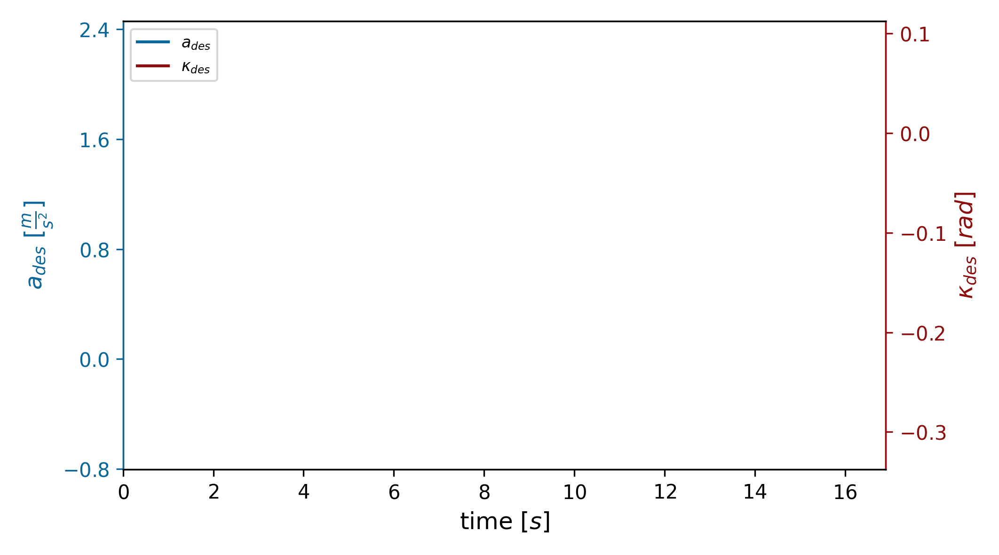

# Scripts

## Plotting

There exist three different plot scripts:

- `plotState.py`: plots variables over time (Details of this script are provided below)
- `plotHorizon.py` (plots variable at given point in time along the horizon
- `plotGroundTruthTrace.py` (plots lane geometries of a serialized osi trace file)

### Detailed `plotState` Functionality
To plot variations of the desired states the following arguments can be passed to the parser:

- **-f**: Needs the path to the desired `vehicle_<xy>.json` input file generated from ikaDriver. This file provides the values for the plot.
- **-p**: Plots one specific value of the Agent defined in -f. If `driver_state`, `ego_input` or `vehicle_state` is choosen, all the corresponding plots will be added and plotted in one multi-figure.
- **-p2**: Adds another value to the plot. No other value will be added in the default case.
- **-a**: Animates the defined plot. The animation speed can be set with the interval argument in the script.
- **-t**: If a certain timespan is of interest, start and end boundaries of the time can be determined. Minimum timestep is 0.1. (Example: 14.5-30.5)
- **-s**: Saves the created plot.
- **-o**: Defines the output path for the plots. The default option creates a debug folder in the current directory where the file will be stored.

The variable names or units can be renamed by passing the new ones as arguments into the two helper functions. 

### Style Options
The script uses the two styles configured in the style_single and style_multi parameters for the related plots. The title-, axis-, label- and tick size can be configured and much more can be set here. Furthermore, the figure size, colors, dots per inch value and legend location can be set in the plotState.py script.

To change the center view of the graph to fit best with the properties every figure is aligned with the tight_layout property. But a specific view on the plot can be configued by appending the function `plt.subplots_adjust(left=x, right=x2, bottom=y1, top=y2, wspace=z)` into the script.

### Example
Here you can see an output of this script where the values of desired acceleration and desired kappa are plotted over a specific time and saved as an animation.

The following command was used for this: 
`python3 plotState.py -f ~/set_level/ika-driver-setlevel/debug/vehicle_16.json -p subconscious_a -p2 subconscious_kappa -a -t 23.0-40.0 -s`

Note: To recreate the four basic maneuvers shown at the SETLevel ASE, use the linked [script](plotBasicManeuvers.sh).